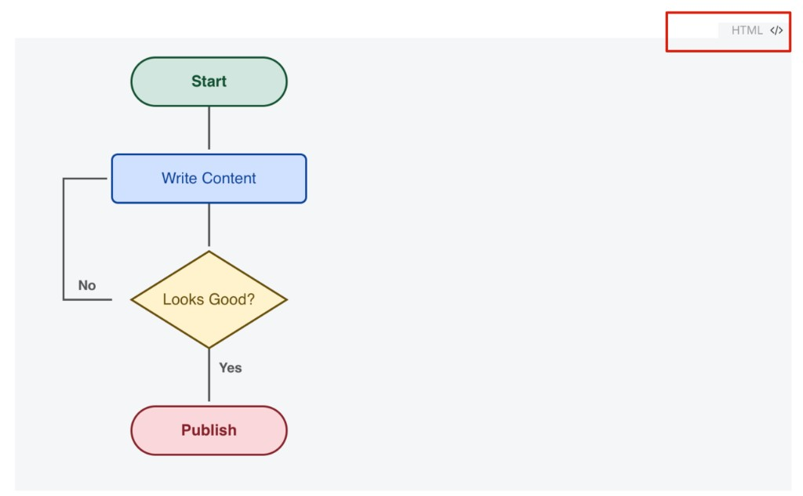

<div align="center">

# Typora AI Edit

**把 Typora 变成 AI 驱动的写作与生产力工具。**

[](https://github.com/Aurisper/typora-ai-edit/releases)
[](LICENSE)
[](https://typora.io/)
[](https://typora.io/)

[](https://platform.openai.com/)
[](src/modules/)
[](https://github.com/Aurisper/typora-ai-edit/pulls)
[](https://github.com/Aurisper/typora-ai-edit/stargazers)
[](https://github.com/Aurisper/typora-ai-edit/issues)

[English](README.md) · [报告 Bug](https://github.com/Aurisper/typora-ai-edit/issues/new?template=bug_report.md) · [功能建议](https://github.com/Aurisper/typora-ai-edit/issues/new?template=feature_request.md)

</div>

---

一款强大的 AI 编辑插件，为 macOS 上的 [Typora](https://typora.io/) 赋能。支持 ChatGPT Plus OAuth 和任意 OpenAI 兼容 API。所有操作都在文档内完成 —— AI 输出即原生 Markdown，Typora 即时渲染，随时导出 PDF 分享。

## 为什么选择 Typora AI Edit？

- **在文档中写作，而非聊天窗口** — AI 的编辑和回答直接出现在你的文档中，不需要在 App 之间切换
- **AI 画流程图** — 让 AI 生成 HTML/CSS/SVG 或 Mermaid 流程图，Typora 即时渲染为可视化图表。通过追问持续优化
- **累计追问** — 在同一文档中持续提问，完整对话上下文保留在 Markdown 中，自然形成知识库
- **内置联网搜索** — 让 AI 搜索互联网获取最新信息，直接写入你的文档
- **一切皆 Markdown** — AI 输出的所有内容都是原生 Markdown（文字、代码、表格、图表、数学公式）。可导出 PDF、HTML，或直接分享 `.md` 文件
- **多模型自由切换** — GPT、Claude、DeepSeek、Qwen、Kimi 等任意 OpenAI 兼容模型，一键切换

## 示例：AI 生成流程图

让 AI 生成流程图 —— 输出 HTML/CSS/SVG 代码，Typora 即时渲染为精美的可视化图表。



> **提示词：** *"画一个内容发布流程的流程图"*
> AI 生成包含 CSS 样式和 SVG 图形的 HTML 代码块，Typora 在文档中直接渲染为可视化图表 —— 无需额外工具。你可以继续追问，如 *"在发布前增加一个审核步骤"*，迭代优化图表。AI 也支持生成 Mermaid 代码用于更简单的图表。

## 功能

<table>
<tr>
<td width="50%">

### AI 写作与编辑
- **AI 优化选中文字** — 选中文字后右键，一键润色
- **参考全文优化** — 结合全文语境进行优化
- **自定义指示** — 每次操作前可输入额外要求
- **停止生成** — 处理过程中可随时停止

</td>
<td width="50%">

### AI 问答与知识构建
- **文档内 AI 问答** — 按 `⌘E` 向 AI 提问
- **累计追问** — 全文上下文自动保留
- **流程图与图表** — HTML/SVG/Mermaid 即时渲染
- **联网搜索** — 获取实时信息，引用来源

</td>
</tr>
<tr>
<td width="50%">

### AI 图片分析
- **AI 图片解读** — 右键图片进行 AI 分析
- **智能压缩** — 自动缩放（2048px）+ JPEG 80%
- **图片缩放** — 100% / 75% / 50% / 33% / 25% / 10%

</td>
<td width="50%">

### 多 Provider 与模型管理
- **多 Provider 支持** — ChatGPT OAuth 或 OpenAI 兼容 API
- **自动模型测试** — 验证可用性、联网、视觉能力
- **能力感知 UI** — 菜单根据模型能力自动调整
- **一键切换** — 右键子菜单切换模型

</td>
</tr>
</table>

### 飞书在线文档

- **保存为飞书在线文档** — 右键 →「保存为飞书在线文档」，自动生成飞书在线文档
- **本地编辑飞书文档** — 在文档管理器中点击「编辑」将文档加载到 Typora，编辑后一键覆盖更新到飞书
- **停止归档** — 归档过程中可随时点击「停止」取消操作
- **AI 标题生成** — 根据文档内容自动生成简洁标题
- **纯 JS DOCX 引擎** — 内存中 Markdown→DOCX 转换，零外部依赖（无需 Pandoc）
- **Session 管理** — 同文档覆盖更新，不同文档独立管理
- **文档管理器** — 浏览、搜索（标题 + 全文）、分页、编辑、删除已归档的飞书文档
- **操作日志面板** — 查看日志、一键复制、一键清除

### 生产力

- **原生 Markdown 输出** — 可导出 PDF / HTML / Word
- **可配置快捷键** — 自定义快捷键（默认：`⌘E`）
- **提示词自定义** — 可视化编辑 System / User Prompt
- **自动语言检测** — 根据系统语言自动切换中/英文界面
- **暗色主题适配** — 所有 UI 自动跟随系统暗色模式

## 使用场景

| 场景 | 方法 |
|------|------|
| 润色一段文字 | 选中文字 → 右键 → AI 优化选中文字 |
| 生成流程图 | `⌘E` → "画一个用户注册流程的流程图" |
| 编辑已有图表 | `⌘E` → "在上面的流程图中增加一个错误处理分支" |
| 调研一个话题 | `⌘E` + 联网搜索 → "AI Agent 的最新发展趋势是什么？" |
| 分析图片内容 | 右键图片 → AI 图片解读 → "提取图中所有数据" |
| 构建问答知识库 | 在一个文档中持续追问，开启全文上下文 |
| 翻译内容 | 选中文字 → 右键 → AI 优化 → "翻译为日语" |
| 保存为飞书文档 | 右键 →「保存为飞书在线文档」→ 自动生成标题并创建飞书在线文档 |
| 编辑飞书文档 | 「飞书文档管理」→ 点击「编辑」→ 在 Typora 中修改 →「保存到飞书」 |
| 管理飞书文档 | 右键 →「飞书文档管理」→ 搜索、浏览、编辑、删除 |
| 查看操作日志 | 右键 →「查看日志」→ 查看操作记录、复制或清除 |

## 开始使用

### 前置条件

- macOS + [Typora](https://typora.io/)（基于 Electron）
- **方案 A: ChatGPT Plus** — 通过 [oauth-cli-kit](https://pypi.org/project/oauth-cli-kit/) 完成 OAuth 登录
- **方案 B: OpenAI 兼容 API** — 任意兼容 API 端点 + API Key

```bash
# ChatGPT Plus 用户：
pip install oauth-cli-kit
```

### 安装

```bash
# 关闭 Typora
sudo bash bin/install.sh
# 重新打开 Typora
```

安装脚本会：
1. 将插件文件复制到 Typora 资源目录
2. 在 Typora 的 `index.html` 中注入 `<script>` 标签

### 卸载

```bash
sudo bash bin/uninstall.sh
```

## 快速开始

### 文字优化

1. 在 Typora 中**选中文字**
2. **右键** → **「AI 优化选中文字」**（或「参考全文」版本）
3. 输入额外指示（可留空），点击**「开始」**
4. AI 返回结果后自动替换选区

### AI 问答与流程图

1. 光标在空白位置（不选中文字），按 **`⌘E`** 或右键 → **「AI 问答」**
2. 输入问题 — 如 *"画一个 CI/CD 流水线的 HTML 流程图"*
3. 可选开启 **联网搜索** 和/或 **包含全文上下文**
4. 点击**「开始」**— AI 回答以 Markdown 引用格式插入
5. 图表类回答：Typora 即时渲染 HTML/SVG 和 Mermaid 代码为可视化流程图
6. 继续追问修改 — 如 *"在部署失败后增加一个回滚步骤"*

### 图片解读

1. **右键点击图片**
2. 点击**「AI 图片解读」**
3. 输入额外指示，点击**「开始」**
4. 查看 AI 分析结果 — 可**复制**或**插入到图片下方**

### 右键菜单

```
┌──────────────────────────────────┐
│ 🖼 AI 图片解读                    │  ← 右键图片时显示
│ ─────────────────────────────── │
│ ✦ AI 优化选中文字                 │  ← 选中文字时显示
│ ✦ AI 优化（参考全文）              │
│ ─────────────────────────────── │
│ 💬 AI 问答                  ⌘E  │  ← 无选区时显示
│ ─────────────────────────────── │
│ ✂ 剪切                    ⌘X   │
│ ⧉ 复制                    ⌘C   │
│ 📋 粘贴                   ⌘V   │
│ ─────────────────────────────── │
│ ⚙ AI 模型                  ▸   │
│ 🌐   AI 联网搜索                │
│ ─────────────────────────────── │
│ 📤 保存为飞书在线文档               │
│ 📂 飞书文档管理                    │
│ 📋 查看日志                       │
│ ─────────────────────────────── │
│ ⚙ AI 编辑设置…                  │
└──────────────────────────────────┘
```

## 开发

### 更新插件

修改 `src/modules/` 下的模块文件后：

```bash
bash build.sh
sudo cp src/typora-ai-edit.js \
  /Applications/Typora.app/Contents/Resources/TypeMark/ai-edit/typora-ai-edit.js
# 重启 Typora
```

### 项目结构

```
├── src/
│   ├── modules/                # 模块化源码（编辑这些文件）
│   │   ├── 01-i18n.js          # 语言检测 + 本地化字符串
│   │   ├── 02-config.js        # 常量、默认配置、加载/保存
│   │   ├── 03-platform.js      # 文件 I/O、Token、图片处理
│   │   ├── 04-api.js           # API 调用、SSE 解析、终止
│   │   ├── 05-model-test.js    # OpenAI 模型测试
│   │   ├── 06-editor.js        # 选区、代码块、替换
│   │   ├── 07-ui-core.js       # Toast、剪贴板、快捷键
│   │   ├── 08-ui-menu.js       # 右键菜单 + 粘贴
│   │   ├── 09-ui-dialogs.js    # 优化 + 图片对话框
│   │   ├── 10-ui-qa.js         # AI 问答对话框
│   │   ├── 11-ui-settings.js   # 设置面板
│   │   ├── 12-styles.js        # CSS 注入
│   │   ├── 13-main.js          # 初始化 + 事件绑定
│   │   ├── 14a-feishu-core.js  # 飞书 API：鉴权、上传、导入、删除
│   │   ├── 14b-feishu-ui.js    # 飞书在线文档流程 + 进度 UI
│   │   ├── 14c-md2docx.js      # 纯 JS 内存 Markdown → DOCX
│   │   └── 15-logger.js        # 操作日志面板
│   └── typora-ai-edit.js       # 构建产物（自动生成）
├── build.sh                    # 构建脚本：模块 → 单文件 IIFE
├── bin/
│   ├── install.sh              # 安装脚本
│   └── uninstall.sh            # 卸载脚本
└── doc/
    ├── requirements.md         # 需求文档
    ├── development.md          # 技术实现文档
    └── feishu-dev-plan.md      # 飞书集成开发计划
```

### 技术要点

| 模块 | 实现方式 |
|------|---------|
| 脚本注入 | 修改 Typora `index.html`，追加 `<script>` 标签 |
| AI 接口 | ChatGPT Codex Responses API 或 OpenAI 兼容 `/v1/chat/completions`（SSE 流式） |
| 认证 | 读取 `oauth-cli-kit` 本地 Token 文件或 API Key |
| 编辑器交互 | `window.getSelection()` + `execCommand` + CodeMirror API |
| 全文获取 | `window.File.editor.getMarkdown()`（Typora 内部 API） |
| 配置存储 | `localStorage` |
| 图片处理 | 本地 → base64，网络 → 下载，canvas 兜底，自动压缩 |
| 右键菜单 | 拦截 `contextmenu` 事件，自定义 HTML 浮层 |
| 图表渲染 | AI 生成 HTML/CSS/SVG 或 Mermaid → Typora 内联渲染 |
| 飞书在线文档 | 纯 JS DOCX 生成（CRC32+ZIP+OOXML）→ `fetch` 上传 → 导入 API；AbortController 支持取消 |
| 文档管理器 | Session 文档列表 + 搜索 + 分页 + 本地编辑 + 回写覆盖 + 删除 |
| 操作日志 | 内存日志存储（500 条）+ 模态面板，支持复制/清除 |

## 参与贡献

欢迎贡献代码！请先阅读 [CONTRIBUTING.md](CONTRIBUTING.md) 了解贡献流程。

- [报告 Bug](https://github.com/Aurisper/typora-ai-edit/issues/new?template=bug_report.md) — 发现问题？请告诉我们
- [功能建议](https://github.com/Aurisper/typora-ai-edit/issues/new?template=feature_request.md) — 有好主意？欢迎分享
- [Pull Requests](https://github.com/Aurisper/typora-ai-edit/pulls) — 随时欢迎提交 PR

请同时查阅我们的[行为准则](CODE_OF_CONDUCT.md)和[安全政策](SECURITY.md)。

## 更新日志

<details open>
<summary><strong>v0.8.0</strong> — 飞书文档编辑 & 归档控制 (2026-03-26)</summary>

- **新增：本地编辑飞书文档** — 在文档管理器中点击「编辑」，将已归档文档加载到 Typora 编辑器；顶部出现蓝色状态条，点击「保存到飞书」即可覆盖更新原文档
- **新增：停止归档** — 归档进度面板新增「停止」按钮，可在任意步骤取消归档流程；使用 `AbortController` 中断正在进行的网络请求和轮询
- **新增：完整内容缓存** — 归档文档现存储完整 Markdown 原文（不再仅缓存前 5000 字符），支持无损本地编辑
- **优化：飞书 API 中断支持** — 所有飞书 API 函数（鉴权、上传、导入、轮询）均支持可选 `AbortSignal` 参数
- **优化：文档管理器 UI** — 每条文档同时显示「编辑」和「删除」两个操作按钮

</details>

<details>
<summary><strong>v0.7.0</strong> — 飞书集成 & 文档管理 (2026-03-25)</summary>

- **新增：保存为飞书在线文档** — 右键 →「保存为飞书在线文档」，自动将当前 Markdown 文档创建为飞书在线文档
- **新增：AI 标题生成** — 根据文档内容自动生成简洁标题
- **新增：纯 JS DOCX 引擎** — 内存中 Markdown→DOCX 转换（自写 CRC32 + ZIP + OOXML），零外部依赖（无需 Pandoc、Node.js fs/child_process）
- **新增：飞书文档管理器** — 浏览所有已归档文档，支持按标题或全文搜索（内容缓存）、分页浏览（每页 10 条）、一键删除
- **新增：飞书 Session 管理** — 同文档覆盖更新旧版，不同文档独立管理，自动缓存内容用于搜索
- **新增：操作日志面板** — 右键 →「查看日志」，查看操作记录与错误，支持一键复制、一键清除
- **新增：飞书设置项** — 设置面板中可配置 App ID、App Secret、目标文件夹 Token
- **优化：日志集成** — 所有主要操作与错误均记录到日志面板
- **架构：飞书模块拆分** — `14a-feishu-core.js`（API）、`14b-feishu-ui.js`（流程 UI）、`14c-md2docx.js`（DOCX 引擎）、`15-logger.js`（日志）

</details>

<details>
<summary><strong>v0.6.0</strong> — 模块化架构 & 代码块编辑 (2026-03-24)</summary>

- **新增：模块化代码架构** — 将 2500 行单文件拆分为 13 个功能模块
- **新增：构建脚本** — `build.sh` 按编号合并模块，包裹 IIFE
- **优化：代码块 AI 编辑** — 全面支持 Mermaid、HTML/SVG、围栏代码块
- **优化：HTML 块替换** — 文件级 Markdown 替换，解决渲染块修改问题
- **优化：流式对话框** — 所有 AI 操作流式显示输出，提供停止/确认按钮
- **修复：Q&A 插入失败** — 弹窗打开前保存光标位置
- **修复：CodeMirror 选区检测** — 可靠检测代码块内选中文字

</details>

<details>
<summary><strong>v0.5.x</strong> — 多 Provider 支持 (2026-03-24)</summary>

- **新增：多 Provider 支持** — ChatGPT OAuth 或 OpenAI 兼容 API
- **新增：自动模型测试** — 验证可用性、联网搜索和图片解析能力
- **新增：能力感知 UI** — 界面根据模型能力自动调整
- **优化：实时测试日志** — 设置面板内实时显示测试进度
- **优化：自动获取模型** — 留空时自动从 API 端点获取

</details>

<details>
<summary><strong>v0.4.0</strong> — AI 问答 (2026-03-24)</summary>

- **新增：文档内 AI 问答** — `⌘E` 提问，回答以引用格式插入
- **新增：可配置快捷键** — 设置面板中自定义问答快捷键
- **新增：问答提示词自定义** — System / User Prompt 可编辑

</details>

<details>
<summary><strong>v0.3.x</strong> — 图片分析 & 国际化 (2026-03-24)</summary>

- **新增：AI 图片解读** — 右键图片进行 AI 分析
- **新增：图片压缩** — 自动缩放 + JPEG 转换
- **新增：图片缩放子菜单** — 100% / 75% / 50% / 33% / 25% / 10%
- **新增：自动语言检测** — 中英文界面自动切换

</details>

<details>
<summary><strong>v0.1.0</strong> — 首次发布 (2026-03-24)</summary>

- AI 文字优化、指示弹窗、模型切换、联网搜索、停止生成、提示词设置、暗色模式

</details>

## 注意事项

- Typora 升级后可能需要重新执行 `install.sh`
- ChatGPT OAuth Token 过期后需通过 `oauth-cli-kit` 重新登录
- 按 `Option+Command+I` 可打开 Typora 开发者工具查看 `[AI Edit]` 日志
- Typora 原生支持 HTML 块和 Mermaid —— AI 生成的图表代码会自动渲染

## License

本项目采用 MIT 许可证 — 详见 [LICENSE](LICENSE) 文件。

---

<div align="center">

**如果觉得这个项目有帮助，请给一个 ⭐ 支持一下**

[报告 Bug](https://github.com/Aurisper/typora-ai-edit/issues/new?template=bug_report.md) · [功能建议](https://github.com/Aurisper/typora-ai-edit/issues/new?template=feature_request.md) · [参与贡献](CONTRIBUTING.md)

</div>
